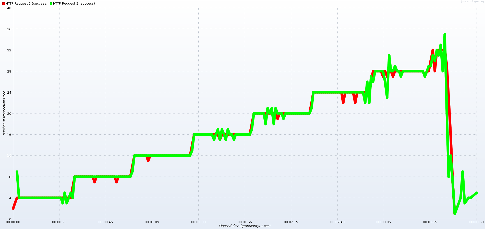
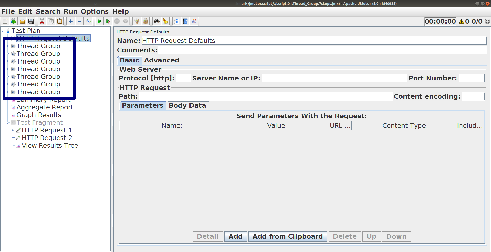

# Ускоряем Apache.JMeter

> «Ты можешь быстрее. Предела нет. Знай: ты можешь! Будь уверен.»
(Морфеус, «Матрица»).

# История вопроса

Инженер может хотеть от JMeter высокой интенсивности выполнения операций:
* [Почему jmeter работает медленно?](https://toster.ru/q/489391) - @nuclear_kote (18 дек. 2017)
* [Причина низкой скорости выполнения запросов в Jmeter?](https://toster.ru/q/487454) - @leksoQA (11 дек. 2017)

Но может не уметь задавать желаемую интенсивность:
* [JMeter настройка Thread Group, что означает Rump-Up period?](https://toster.ru/q/284055) - @kislinskiy_anton ( Вопрос задан более двух лет назад )

# Способы и цели подачи нагрузки в Apache.JMeter

* открытая нагрузка - пристрелочный тест
* закрытая нагрузка - боевой тест


## Пристрелочный тест
Пристрелочный тест - подаём максимально возможную нагрузку, тем количеством ресурсов (потоков / вирутальных пользователей), которые нам доступны.

Мы задаём количество пользователей, которые будет работать с системой. А интенсивность - количество операций в сек или операций в минуту, мы узнаём по факту. И не контролируем ход повышения интенсивности.

Интенсивность в момент времени T:
1. Состав запросов в сценарии
* Количество пользователей
* Время обработки запросов в сценарии

Чем медленее система отвечает, тем реже пользователь посылает запросы.

## Боевой тест
Боевой нагрузочный тест - контроллируем интенсивность выполнения сценариев.

> Написать

Интенсивность в момент времени T:
* один пользователь выполняет одну операцию:
  * задаётся расписание запуска пользователей
    * реализуется просто через `Thread Group` - самый простой вариант
      * но имеет дефект - нагрузка должна быть кратна 8-ми запускам потоков в сек (8, 16, ...) задать 10 стартов потоков в сек не получится, будет выполняться 8
* один пользователь выполняет несколько операций:
  * задаётся количество потоков / виртуальных пользователей
  * задаётся фиксированный шаг нагрузки (Paicing) или желаемая интенсивность выполнения
  * варианты реалиации:
    * количество пользователей:
      * Thread Group
      * Ultimate Thread Group
    * элемент с таймером:
      * [`Flow Control Action` (ранее назывался `Test Action`)](http://jmeter.apache.org/usermanual/component_reference.html#Flow_Control_Action) или любой другой первый Sampler
    * таймер:
      * [`Constant Throutput Timer`](http://jmeter.apache.org/usermanual/component_reference.html#Constant_Throughput_Timer)
      * [`Precise Throutput Timer`](http://jmeter.apache.org/usermanual/component_reference.html#Precise_Throughput_Timer)
* заранее неизвестное количество пользователей, но известное значение RPS:
  * [`Concurrency Thread Group`](https://jmeter-plugins.org/wiki/ConcurrencyThreadGroup/),   [`Throughput Shaping Timer`](https://jmeter-plugins.org/wiki/ThroughputShapingTimer/) и [`Schedule Feedback Function`](https://jmeter-plugins.org/wiki/ThroughputShapingTimer/#Schedule-Feedback-Function)


## Примечание
В разных источниках это называется по разному. В терминах Яндекс.Танк это называется:
* закрытая нагрузка
* открытая нагрузка

# Нехватка оперативной памяти

Если заданное количество потоков не помещается в заданные размеры Java heap space, то это можно будет узнать во время выполнения по ошибке:

>  OutOfMemoryError: Java heap space

Пример запуска теста, где такое может проявиться:
```
$ ./run.sh ./script.01.Thread_Group.jmx --nongui
Creating summariser <summary>
Created the tree successfully using ./script.01.Thread_Group.jmx
Starting the test @ Mon Oct 01 17:21:27 MSK 2018 (1538403687382)
Waiting for possible Shutdown/StopTestNow/Heapdump message on port 4445
summary +     19 in 00:00:02 =    7.7/s Avg:     0 Min:     0 Max:     2 Err:     0 (0.00%) Active: 1 Started: 10 Finished: 9
summary +    256 in 00:00:30 =    8.6/s Avg:     0 Min:     0 Max:    12 Err:     0 (0.00%) Active: 2 Started: 139 Finished: 137
summary =    275 in 00:00:32 =    8.5/s Avg:     0 Min:     0 Max:    12 Err:     0 (0.00%)
summary +    498 in 00:00:30 =   16.6/s Avg:     0 Min:     0 Max:     2 Err:     0 (0.00%) Active: 3 Started: 389 Finished: 386
summary =    773 in 00:01:02 =   12.4/s Avg:     0 Min:     0 Max:    12 Err:     0 (0.00%)
summary +    738 in 00:00:30 =   24.6/s Avg:     0 Min:     0 Max:    19 Err:     0 (0.00%) Active: 2 Started: 757 Finished: 755
summary =   1511 in 00:01:32 =   16.4/s Avg:     0 Min:     0 Max:    19 Err:     0 (0.00%)
summary +    976 in 00:00:30 =   32.6/s Avg:     0 Min:     0 Max:    17 Err:     0 (0.00%) Active: 2 Started: 1245 Finished: 1243
summary =   2487 in 00:02:02 =   20.3/s Avg:     0 Min:     0 Max:    19 Err:     0 (0.00%)
summary +   1214 in 00:00:30 =   40.4/s Avg:     0 Min:     0 Max:     1 Err:     0 (0.00%) Active: 4 Started: 1854 Finished: 1850
summary =   3701 in 00:02:32 =   24.3/s Avg:     0 Min:     0 Max:    19 Err:     0 (0.00%)
summary +   1454 in 00:00:30 =   48.5/s Avg:     0 Min:     0 Max:     2 Err:     0 (0.00%) Active: 3 Started: 2580 Finished: 2577
summary =   5155 in 00:03:02 =   28.3/s Avg:     0 Min:     0 Max:    19 Err:     0 (0.00%)
summary +   1684 in 00:00:30 =   56.1/s Avg:     0 Min:     0 Max:     2 Err:     0 (0.00%) Active: 8 Started: 3427 Finished: 3419
summary =   6839 in 00:03:32 =   32.2/s Avg:     0 Min:     0 Max:    19 Err:     0 (0.00%)
summary +    488 in 00:00:30 =   16.1/s Avg:     2 Min:     0 Max:   361 Err:     0 (0.00%) Active: 155 Started: 3818 Finished: 3663
summary =   7327 in 00:04:03 =   30.2/s Avg:     0 Min:     0 Max:   361 Err:     0 (0.00%)
java.lang.OutOfMemoryError: Java heap space
Dumping heap to java_pid21386.hprof ...
Heap dump file created [2723488978 bytes in 41,828 secs]
Killed
```

Что тут можно сделать:
* посмотреть на каком количестве потоков памяти хватало, и жить с этим значением
* увеличить размер кучи для JVM (-Xmx)
* оптимизировать скрипт

## Как посмотреть на каком профиле нагрузки памяти хватало

Во время выполнения теста, формируется лог выполнения программы. До момента зависания JMeter пишет этот лог. Поэтому достаточно формировать по записанному логу отчёт.

Сначала проверим, не нужно ли удалить последнюю строку из лога. Так как тест завершился аварийно, то вполне вероятно, что последнаяя строка лога не записалась до конца.

```
$ tail ./logs/2018_10_01_17_21_26_log.jtl
```

Так и есть. Удаляем последнюю строку из файла

```
$ head -n -1 ./logs/2018_10_01_17_21_26_log.jtl > ./logs/2018_10_01_17_21_26_log_FIX.jtl
```

Проверяем, что теперь всё в порядке:

```
$ tail ./logs/2018_10_01_17_21_26_log_FIX.jtl -n 3
```

Всё, битых строк больше нет. Можно формировать отчёт по логу, используя JMeter:

```
$ '/home/x1337/Tools/apache-jmeter-5.0/bin/jmeter' --reportonly ./logs/2018_10_01_15_17_36_log_FIX.jtl --reportoutputfolder ./reports/2018_10_01_15_17_36 --jmeterproperty jmeter.reportgenerator.overall_granularity=1000
```

Или графики, используя [JMeterPluginsCMD Command Line Tool](https://jmeter-plugins.org/wiki/JMeterPluginsCMD/):

```
$ export JMETER_HOME="/home/x1337/Tools/apache-jmeter-5.0"
$ "$JMETER_HOME""/bin/JMeterPluginsCMD.sh" --input-jtl ./logs/2018_10_01_15_17_36_log_FIX.jtl --plugin-type TransactionsPerSecond --width 1900 --height 900 --granulation 1000 --line-weight 10 --generate-png reports/2018_10_01_15_17_36/TransactionsPerSecond.png
```

Получаем, что на седьмой ступени при интенсивности 28 транзакций в сек всё было хорошо:



Таким образом, 28 транзакций в секунду - предел для данного скрипта и данного окружения. Можно ограничить максимальный профиль этим значением и ничего не оптимизировать.

> Не придётся оптимизировать, если время отклика будет стибильным - не будет превышать то время, отклика, что было на 7-й ступени.

`script.01.Thread_Group.7steps.jmx` - скрипт, в котором оставлены только семь ступеней.



В скрипте осталось только 7 ступеней. Но в варианте задания профиля нагрузки через `Thread Group` без ограничения максимального количества потоков, как сейчас, остаётся вероятность `OutOfMemoryError`. Достаточно, чтобы ответы стали обрабатываться чуть дольше, и потоки тут же накопятся, что приведёт к исчерпани ресурсов на нагрузочной станции.

```
$ export JMETER_HOME="/home/x1337/Tools/apache-jmeter-5.0"
$ "$JMETER_HOME""/bin/JMeterPluginsCMD.sh" --input-jtl ./logs/2018_10_01_15_17_36_log_FIX.jtl --plugin-type ResponseTimesDistribution --width 1900 --height 900 --granulation 1000 --line-weight 10 --generate-png reports/2018_10_01_15_17_36/ResponseTimesDistribution.7step.png --start-offset 180 --end-offset 210
```

# Какой инструмент быстрее?

Исследования на тему производительности инструментов:

29 сентября 2017 года, Dmitri Tikhanski
* https://www.blazemeter.com/blog/open-source-load-testing-tools-which-one-should-you-use
  * [Locust 0.8](https://locust.io/)
  * [JMeter 3.3](http://jmeter.apache.org/download_jmeter.cgi)
  * [Tsung 1.7.0](http://tsung.erlang-projects.org/)
  * Gatling 2.3.0
  * The Grinder 3.11

> As shown in the graphs, Locust has the fastest response times with the highest average throughout, followed by JMeter, Tsung and Gatling. The Grinder has the slowest times with the lowest average throughput.

# Где можно научиться писать быстрые тесты?

Целенаправленно такой аспект не выделяется. Но частично затрагивается в различных источниках.

## Видео, презентации, слайды

### Алексей Лавренюк — Учимся анализировать результаты нагрузочного тестирования
Мы «обстреляем» учебный web-сервис на Python Tornado, который специально написан так, чтобы проявились проблемы производительности. Мы разберемся в разных типах графиков в отчетах о производительности, поняв, что на них можно увидеть. Будет рассказано, какие тесты нужно провести для того, чтобы определить производительность сервиса. Мы проанализируем результаты этих тестов и узнаем как обнаружить с их помощью узкие места.

Видео: https://www.youtube.com/watch?v=gws7L3EaeC0


Курсы:
* Тестирование производительности (JMeter)
[курс Алексея Баранцева](http://software-testing.ru/edu/1-schedule/19-performance-testing-jmeter)
  * тренер: Алексей Баранцев
  * стоимость: 6500 руб
* JMeter (тренинг) [курс Performance Lab](https://www.performance-lab.ru/trening/load-testing-trening/jmeter)
  * тренер: Дмитрий Кулешов (возможно)
  * стоимость: 6600 руб
* Тестирование производительности с использованием jMeter: от старта проекта до финальных отчетов [курс Luxoft](https://www.luxoft-training.ru/kurs/testirovanie_proizvoditelnosti_s_ispolzovaniem_jmeter_ot_starta_proekta_do_finalnyh_otchetov.html)
  * тренер: Серик Бейсенов (возможно)
  * стоимость: 9630 руб


В разделе "Модуль 2.5. Проверки (assertions)" есть тема "Контроль времени отклика".
Ограничить и контроллировать максимальное время на установку соединения и на получение ответа важно, чтобы тест не зависал.

## Защита от зависания тестов

Реализуется комбинацией настроек элементов:
* Thread Group
* Sampler

Зависающий тест это:
* много потоков, которые ждут ответа от сервера
* много лишних затрат оперативной памяти, исчерпание других ресурсов нагрузочной станции
* в результате замедляется работа всех потоков, даже тех, где сервер ещё отвечает на запросы

Ограничения рекомендую такие:
* `Connection: 3000` если на балансировщике нагрузке достигнут лимит на подключение клиентов, то ждать подключения уже не имеет смысла. Ожидание лишь приведёт к большому количеству новых потоков в Apache.JMeter, под которые будут выделены ресурсы нагрузочной странции.
* `Responce: 5000` если речь идёт о запросе, который возвращается за 100-200 мсек, то предел ожиданий ответа на запрос может быть 5 сек, если ответа нет, то сервер приложений или сервер баз данных не смогли обработать ответ быстро.
* `Responce: 60000` или отсутствие ограничения `Responce: ` если тестируется не пользовательская система, не многопользовательская система. Если важно получить ответ от сервера, и известно, что сервер может отвечать 5 или 10 минут, и в профиле нагрузке нет задачи выдерживать требуемую интенсивность, то можно ждать

Если сработает лимит на `Timeouts Connection`, то будет ответ
``

Если сработает лимит на `Timeouts Responce`, то будет ответ


И важно в катушке выставить

Кроме того есть плагин [AutoStop](https://jmeter-plugins.org/wiki/AutoStop/)
Позволяет останавливать тест при следующих условиях:
* Среднее время ответа (Response Time) на протяжении N секунд превысило заданное значение
* Среднее время до начала получения ответа на запрос (Latency) на протяжении N секунд превысило заданное значение
* Процент ошибок запросов на протяжении N секунд превысил заданный процент

Удобно использовать [AutoStop](https://jmeter-plugins.org/wiki/AutoStop/) в комбинации с [Duration Assertion](http://jmeter.apache.org/usermanual/component_reference.html#Duration_Assertion). Ключевые запросы, выполнение которых стало слишком долгим, будут помечаться, как ошибочные. И когда количество ошибок станет большим - тест прервётся.
